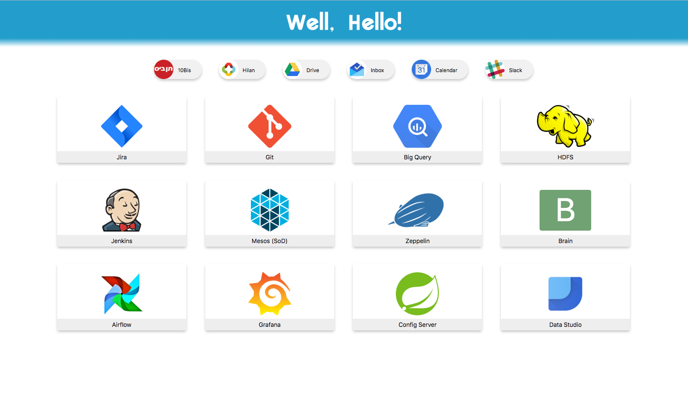
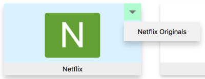

# New Tab Extension for Chrome



## Pre-requirements:
Run:
```
pip install pyyaml
```
(or `pip3` if you use Python 3.x)

## Installation:
* Extract all files to any directory
* In Chrome, go to [`chrome://extensions`](chrome://extensions)
* Enable _Developer Mode_
* Click _Load Unpacked_ and choose the directory you placed the files in

## Creating custom tabs:
Follow the instructions below and use the `create.py` script.
This script supports both Python 2.7 and 3.x.

### Configuring links:
One YML files are used required: `config.yml`. This file can have two optional sections, `chips` and `cards`,
where chips are the small links at the top and cards are the big ones underneath them (see screen-shot above).

The syntax for both sections is as follows:
```
- Site 1 Name: Site URL
  image: image_name  # all images are found under the "img" directory. This is optional
  more:              # optional, will add links as a dropdown menu
  - Extra 1: URL
  - Extra 2: URL
  
- Site 2 Name: Site URL
  ...
```

For example, the following `yml` will create the card in the picture:
```
- Netflix: "http://www.netflix.com"
  more:
  - Netflix Originals: "http://www.netflix.com/originals"
```



### Configuring images:
The script automatically look for an image named `img/[name].png`, where `[name]`
is the name defined in the YML file (lowered-case and with no spaces, so for `HBO`
it will look for an image named `img/hbo.png` and for `Big Query` it will look
for `img/bigquery.png`). If no such image is found, then no image will be used for 
Chips, and a colored square with the first letter will be used for Cards (see the
rightmost card on the second row in the screen-shot).

**Defining alternative images:** You can specify an alternative image file instead
of the one looked for by default. To do so, add the `image` key to the site on the
YML file (see example above). All images are assumed to be found in the `img/` 
directory.

### Adding break lines to drop-down menus:
It is possible to add break-lines to a drop down menu. Simply insert an undescore
(`_`) as an element of `more`. For example:
```
- Netflix: "http://www.netflix.com"
  more:
  - Netflix Originals: "http://www.netflix.com/originals"
  - _
  - Netflix Careers: "http://www.netflix.com/careers"
```

### Running the script:
Assuming the files were placed in: `~/newtab/`, run:
```
cd ~/newtab
python create.py
``` 
There's no need to reinstall the extension, any changes to the new-tab page will take effect immediately.